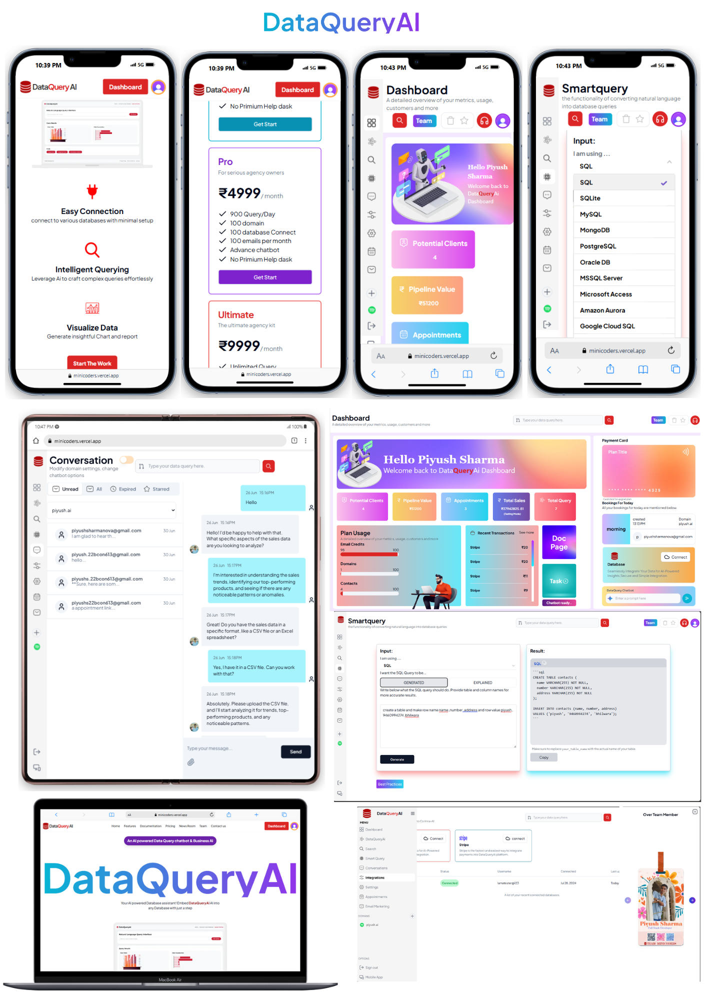
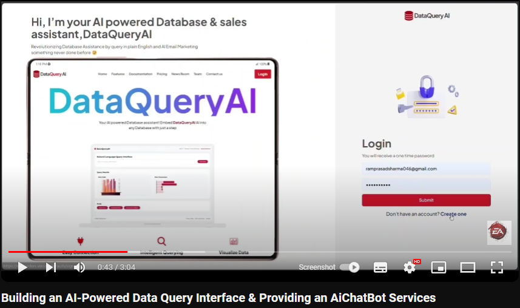
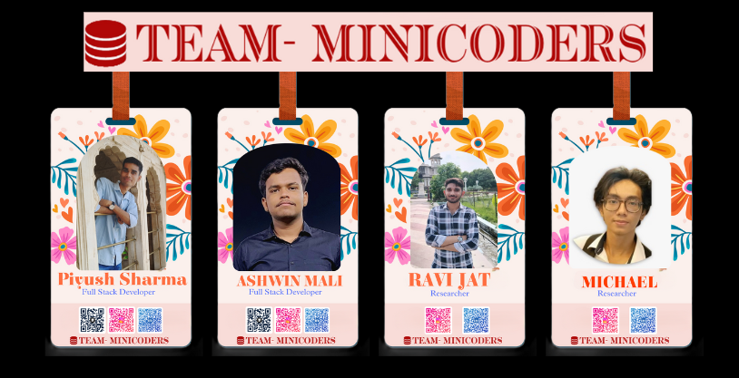

# Building an AI-Powered Data Query Interface & Providing an AiChatBot Services

## Project live deploy url = https://minicoders.vercel.app/

### Video Demo 
#### Team
- Ashwin (Team member) Voice demo Video [Link](https://www.youtube.com/watch?v=WlMraLCJOuw&t=17s)
- Michael (Team member ) Voice demo Video [Link](https://youtu.be/lotGu_AA14E?si=TRs0AYCr3i_U-I6c)
 

## System Flowcharts 

## Key Features:
### Dashboard
- Centralized control panel to access all features.
- Visual representation of data and insights.
  
### Database Connection and AI Chat
- Connect to multiple database types (MongoDB, MySQL, PostgreSQL, etc.).
- Interactive AI-driven chat interface for database queries.

### Query Translator

- Translate natural language queries into SQL or other database languages.
- Simplify complex query formation.

### Dynamic Search
- Real-time search capabilities within connected databases.
- Filter and retrieve data dynamically.

### Payment Integration
- Secure payment processing integrated within the platform.
- Support for multiple payment gateways.

### AI Chatbot Services
- Provide chatbot services to other websites.
- AI-driven responses for customer interaction and support.

### AI Email Marketing
- Automated email marketing campaigns.
- Personalized content generation for targeted audiences.

### AI Appointment Fixer

- Schedule appointments through AI-driven interactions.
- Integrated calendar and booking system.

### Mind Fresh Music Section (Meditation Songs)
- Collection of meditation and relaxation music.
- Enhance user experience with a mind-refreshing section.

### All-in-One Database Management
- Integration with multiple database types (MongoDB, SQL, and others).
- Unified platform for seamless database management.

### Data Visualization and Manipulation
- Advanced tools for visualizing and manipulating data directly within the platform.
- Enhanced capabilities for better data insights and management.

### AI-Based Query Processing
- Support for running AI-driven queries on user databases.
- English language prompts for ease of use.

## Tech Stack

### Frontend:
- React.js: For building the user interface.
- Next.js: Framework for server-side rendering and static site generation.
- TypeScript: For type safety and better code maintainability.
- Tailwind CSS: For styling and responsive design.

### Backend:
- Node.js: Server-side runtime environment.
- Express.js: Web framework for building APIs.
- TypeScript: For type safety and better code maintainability.

### Database:
- PostgreSQL: Advanced relational database with support for complex queries.
- Neon tech cloudbase database storages
- Prisma: ORM for database management and queries.

### Authentication:
- Clerk: Authentication and user management.

### Email and Notification:
- Nodemailer: Nodemailer is a module for Node.js applications to allow easy as
- Pusher : Powering realtime experiences for mobile and web

### Deployment and DevOps:
- Vercel: For deploying the Next.js frontend.
- Github: For version control and collaboration.
- Postman: For API testing.

### LLM Model
- Gemini AI: For advanced generative language capabilities and content generation.

## Team 

